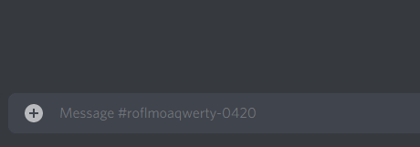

# 📋 Snippets
Snippets, sometimes also called "canned messages" or "tags", are commonly used messages you can send in Modmail threads with just 1 command.

## View available snippets
### `!snippets` / `!s <shortcut>`

To view all available snippets, use the command `!snippets`.

To view a specific snippet's text, use the command `!s <shortcut>`.
For example, to view the text of a snippet called "hi", run `!s hi`.

## Creating snippets
### `!s <shortcut> <text>`

#### Example
To create a snippet called "hi" with the text "Hello, how can we help you?", use the following command:

`!s hi Hello, how can we help you?` 

## Using snippets
### `!!shortcut` / `!!!shortcut`
Inside a Modmail thread, use `!!shortcut` to send a snippet to the user, replacing `shortcut` with the snippet's name.

To send a snippet anonymously, use `!!!shortcut`.

*The prefixes `!!` and `!!!` can be changed with the bot options `snippetPrefix` and `snippetPrefixAnon` respectively.*

#### Example
To send a snippet called "hi", use the following command:

`!!hi`

To send that same snippet anonymously, use the following command:

`!!!hi`

## Editing snippets
### `!edit_snippet <shortcut> <text>` / `!es <shortcut> <text>`

#### Example
To edit a snippet called "hi" to say "Hello, how are you?", use the following command:

`!es hi Hello, how are you?`

## Deleting snippets
### `!delete_snippet <shortcut>` / `!ds <shortcut>`

#### Example
To delete a snippet called "hi", use the following command:

`!ds hi`
